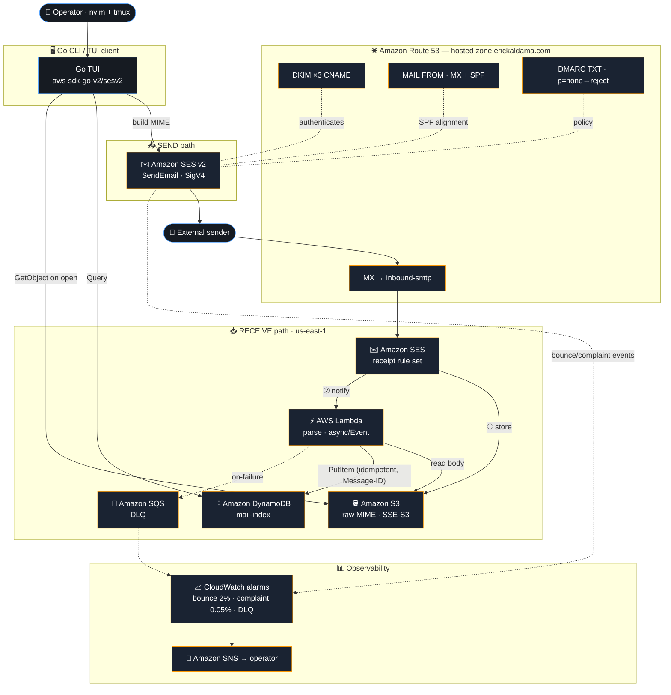

# erickaldama.com — Email System Architecture

A serverless email system on AWS — receive and send for the `erickaldama.com` domain —
provisioned entirely with **AWS CDK (Go)**, consumed by a terminal-native Go client.

> Region: `us-east-1` · Account: ErickSA (367707589526) · All resources provisioned via AWS CDK Go.

## Provisioning & governance

Every resource above — the Route 53 hosted zone, SES identity + DKIM, the S3 bucket, the Lambda,
the DynamoDB table, the SQS DLQ, IAM policies, and the CloudWatch alarms — is provisioned by a single
**AWS CDK app written in Go** (`github.com/aws/aws-cdk-go/awscdk/v2`, latest version, verified live).

This is enforced, not just intended: a `PreToolUse` hook blocks any AWS write that does not come
through the CDK-Go stack, and a skill-recipe verifies live AWS docs before each step.

## Key decisions (audited against Well-Architected)

| Decision | Rationale |
|---|---|
| Region `us-east-1` | SES not available in `mx-central-1`; us-east-1 supports send + receive + SMTP |
| S3 **SSE-S3**, not SES message-encryption | SES message-encryption is client-side (Java/Ruby only) — a Go client could not decrypt its own mail |
| Custom MAIL FROM (`mail.erickaldama.com`) | Required for SPF→DMARC alignment; without it, mail lands in spam |
| Send via SES v2 API + SigV4, **not SMTP** | Eliminates the only long-lived mail secret |
| DynamoDB index (not S3-list) | Makes the TUI listing instant; ~$0 at personal volume |
| DLQ + idempotent PutItem | The one real reliability gap; everything else is right-sized, not over-engineered |
