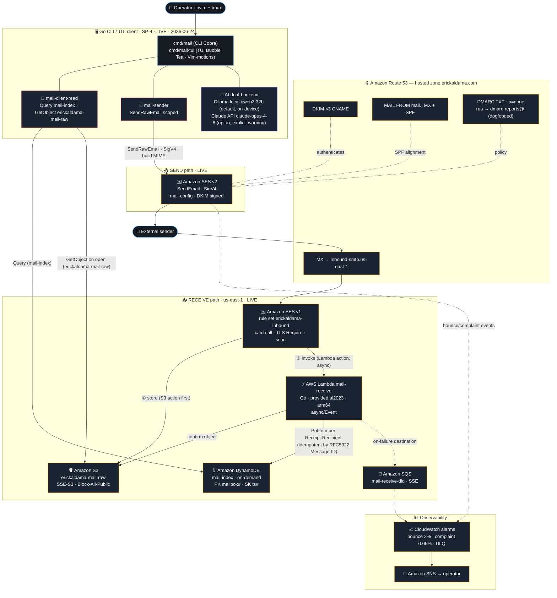

# erickaldama.com — Email System Architecture

A serverless email system on AWS — receive and send for the `erickaldama.com` domain —
provisioned entirely with **AWS CDK (Go)**, consumed by a terminal-native Go client.

> Region: `us-east-1` · Account: ErickSA (367707589526) · All resources provisioned via AWS CDK Go.
>
> **Status (2026-06-25):** the SEND path (SP-2), the RECEIVE path (SP-3), the Go terminal client
> (SP-4, v0.2), and the CD pipeline (GitHub Actions → OIDC → AWS) are **all live and verified** —
> send→receive→read exercised end-to-end against live AWS. The full loop is closed.
>
> **Client v0.2:** `config.toml` (XDG path) drives a multi-mailbox `mail ls` (merged, sorted by `SK`).
> CC/BCC on send/reply + the TUI composer — the **BCC rides only the SES envelope, never the MIME header**
> (privacy invariant, asserted at the core and TUI-end-to-end). Reply-all pre-fills the Cc with the originals.



## CD pipeline — GitHub Actions → OIDC → AWS

Automates `cdk deploy` without long-lived access keys in the repository.

```
GitHub Actions                       AWS (us-east-1 / 367707589526)
─────────────────────────────────    ──────────────────────────────────────────────────────
                                     IAM OIDCProvider
                                     token.actions.githubusercontent.com
                                            │
on: pull_request                            │  StringEquals sub=…:pull_request
  job: diff ──────────────────────────────► mail-cd-diff
              configure-aws-credentials       └─► sts:AssumeRole ──► cdk-hnb659fds-lookup-role
              cdk diff                                               (read-only, no mutations)
              post comment to PR
                                            │
on: push → main                             │  StringEquals sub=…:environment:production
  job: deploy  [GATE 1: Environment         │  (GATE 2: trust — no wildcard, no pull_request)
               production pauses here       │
               until human approves]        │
               │                            │
               └───────────────────────────► mail-cd-deploy
                   configure-aws-credentials  └─► sts:AssumeRole ──► cdk-hnb659fds-deploy-role
                   cdk deploy --all                                   cdk-hnb659fds-file-publishing-role
                                                                      cdk-hnb659fds-image-publishing-role
                                                                      cdk-hnb659fds-lookup-role
```

**Double gate — two independent layers:**

1. **GitHub Environment `production`** — the `deploy` job waits in "Waiting" state until a human approves it
   in the Actions UI. `required_reviewers: [esaldgut]`, branch policy: `main` only.
   CRITICAL: GitHub auto-creates the environment when first referenced but creates it **empty** (no reviewers,
   no branch rules) — the job would run immediately. Configure it before the first push to main.

2. **OIDC trust `StringEquals`** — AWS only issues deploy credentials when the token carries exactly
   `sub=repo:esaldgut/erickaldama-mail:environment:production`. A PR token (`sub=…:pull_request`) cannot
   assume the deploy role even if layer 1 is bypassed.

**IAM roles (both with boundary `erickaldama-boundary`):**

| Role | OIDC sub | Permissions | Smoke result |
|---|---|---|---|
| `mail-cd-diff` | `…:pull_request` | `sts:AssumeRole` on lookup-role only | `implicitDeny` on deploy-role ✓ |
| `mail-cd-deploy` | `…:environment:production` | `sts:AssumeRole` on 4 `cdk-hnb659fds-*` roles | `allowed` on all 4 ✓ |

**Security smoke (DoD #5 — PASS in live AWS):** separation verified empirically via `simulate-principal-policy`
before declaring the CD operational. Two boundary findings caught and fixed before runtime:

- **Boundary v5** (`iam:PutRolePermissionsBoundary`): anti-escalation `Deny` in the boundary blocked CFN from
  attaching a boundary to the new roles. Fixed with a scoped `StringNotEqualsIfExists` exception — only allows
  attaching `erickaldama-boundary` itself. Stack deploy succeeded with v5 active.
- **Boundary v6** (`sts:AssumeRole`, `commit 75c647d`): v5 did not allow `sts:AssumeRole` in the boundary.
  Effective perms = identity ∩ boundary = implicit deny at runtime. Caught by the smoke
  (`PermissionsBoundaryDecision.AllowedByPermissionsBoundary=false`) before any GitHub Actions run.
  Fixed with `sts:AssumeRole` scoped to exactly the 4 `cdk-hnb659fds-*` ARNs (least privilege).

CdStack live: `arn:aws:cloudformation:us-east-1:367707589526:stack/CdStack/a8f59b10` (7/7 CREATE_COMPLETE, 48s).

## Provisioning & governance

Every resource above — the Route 53 hosted zone, SES identity + DKIM, the S3 bucket, the Lambda,
the DynamoDB table, the SQS DLQ, IAM policies, and the CloudWatch alarms — is provisioned by a single
**AWS CDK app written in Go** (`github.com/aws/aws-cdk-go/awscdk/v2`, latest version, verified live).

This is enforced, not just intended: a `PreToolUse` hook blocks any AWS write that does not come
through the CDK-Go stack, and a skill-recipe verifies live AWS docs before each step.

## Key decisions (audited against Well-Architected)

| Decision | Rationale |
|---|---|
| Region `us-east-1` | SES not available in `mx-central-1`; us-east-1 supports send + receive + SMTP |
| S3 **SSE-S3**, not SES message-encryption | SES message-encryption is client-side (Java/Ruby only) — a Go client could not decrypt its own mail |
| Custom MAIL FROM (`mail.erickaldama.com`) | Required for SPF→DMARC alignment; without it, mail lands in spam |
| Send via SES v2 API + SigV4, **not SMTP** | Eliminates the only long-lived mail secret |
| DynamoDB index (not S3-list) | Makes the TUI listing instant; ~$0 at personal volume |
| DLQ + idempotent PutItem | The one real reliability gap; everything else is right-sized, not over-engineered |
| AI default = Ollama local (`qwen3:32b`), not Claude API | Mail corpus never crosses the network without explicit opt-in; `qwen3:32b` is Ollama's reference model for tool-calling |
| Two disjoint IAM users (`mail-client-read` / `mail-sender`) | Least-privilege split: read path cannot send; send path cannot read the inbox |
| `ErrSandboxRecipient` typed sentinel (not string-match) | SES sandbox rejects non-verified recipients; typed error lets callers handle it cleanly without fragile string comparison |
